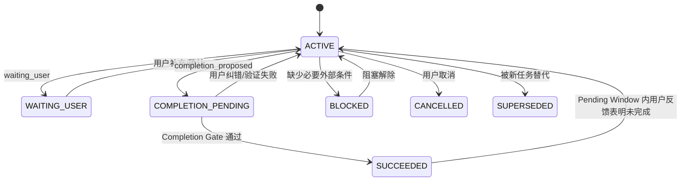
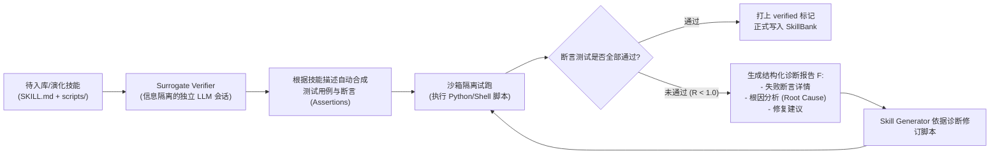

# NovaCode Skills 与自进化技术方案

本文档系统阐述 NovaCode 中 **Skills（技能体系）** 与 **自进化机制（Self-Evolution）** 的完整技术设计方案。本方案深度融合了三篇前沿论文（**AutoSkill**、**CODESKILL** 与 **CoEvoSkills**）的理论精粹，并严格针对现代大模型 Agent 的 **结构化上下文隔离**、**KV Cache 高效复用** 以及 **代码工程场景（SWE）** 进行深度定制与优化。

---

## 1. 概述与核心定位

在 NovaCode 架构中，知识沉淀体系采取了清晰的分层解耦设计：

- **Memory（长期事实记忆）**：负责记录“**过去发生过的事实与偏好**”（如特定环境版本、仓库结构、历史决策等），强调事实检索与时间点感知。
- **Skills（技能体系）**：负责沉淀“**可复用的工作流方法论、排错策略与代码/脚本工具包**”（如 Maven 复杂依赖修复、Git Worktree 高效工作流、特定架构审查规范等），强调通用性、可执行性与跨会话复用。

```mermaid
flowchart TB
    subgraph Storage["1. 存储与资产分级"]
        UserSkill["全局用户级 (~/.novacode/skills/)<br/>跨项目通用 · 个人偏好"]
        ProjSkill["项目专属级 (.agent/skills/)<br/>代码库专属 · 团队/仓库规范"]
    end

    subgraph Runtime["2. 运行时执行 (100% KV Cache 保护)"]
        FixedTools["固定工具接口: invoke_skill / read_skill"]
        ExecJudge{"执行模式判断"}
        InlineMode["Inline 模式: 正文作为 ToolResult 返回<br/>(超长自动经 ArtifactStore 压缩)"]
        ForkMode["Fork 模式: 启动隔离 Subagent<br/>独立上下文执行，仅返回结构化总结"]
        FixedTools --> ExecJudge
        ExecJudge -- inline --> InlineMode
        ExecJudge -- fork --> ForkMode
    end

    subgraph Evolution["3. 双闭环自进化机制"]
        subgraph FastLoop["在线轻量沉淀闭环 (AutoSkill + CODESKILL)"]
            Evidence["证据源: User Feedback + Verified Event + Episode Outcome"]
            Ext["双粒度 Extractor (Task-Level & Event-Driven)"]
            Pending["Pending Candidate Window<br/>等待用户反馈或独立验证"]
            Maint["Maintainer 决策 (Add / Merge / Drop) + 版本演化 (v0.1.0 -> v0.1.1)"]
            Evidence --> Ext --> Pending --> Maint
        end
        subgraph DeepLoop["代理验证与演化闭环 (CoEvoSkills)"]
            Surrogate["Surrogate Verifier: 独立生成测试断言"]
            Sandbox["沙箱试跑 & 脚本自检"]
            Surrogate --> Sandbox
        end
        Maint --> Surrogate
    end

    Storage --> Runtime
    Runtime -. 交互轨迹 & 状态变更 .-> Evolution
    Evolution -. 产出高质量 SKILL.md & 脚本 .-> Storage
```

---

## 2. 核心设计原则与三大硬性保证

### 2.1 结构化上下文（Structured Context）零破坏保证
- **只读消费与解耦**：自进化引擎作为下游消费者，在折叠（Fold）、已验证事件（Verified Event）或 Episode 结果事件时被动消费 `TaskState`、`ToolState` 和证据引用，**绝不逆向篡改**状态机和 `InteractionGroup` 的内部时序结构。
- **天然契合 Trajectory Archive**：技能的调用与执行完全作为标准的 `tool_use` 与 `tool_result` 记录在近期轨迹组中，原生享有状态压缩、折叠（Fold）与回放（Replay）支持。

### 2.2 KV Cache 100% 命中保护保证（Zero Prefix Invalidation）
现代大模型（Anthropic、OpenAI、DeepSeek 等）的 KV Cache 依赖**严格的前缀不变性（Prefix Invariance）**：
1. **禁止 Prompt 头部动态注入**：动态检索到的技能**绝不**注入到 System Prompt（L1）或 `<structured_state>`（L2）中，避免破坏整场会话的头部缓存。
2. **工具列表静态化（Static Tool Schema）**：无论系统中有 5 个还是 500 个技能，`ToolRegistry` 中仅暴露固定的 `invoke_skill`（或 `read_skill`）元工具，Tool Schema 哈希跨轮次保持 100% 恒定。
3. **按需尾部加载（On-Demand Execution）**：技能内容仅作为当前交互步的 `ToolResult`（或当前轮 User 消息的尾部 Wrap）产生，前序所有已缓存的 Token（System + Tools + 历史轨迹）命中率保持 100%。

### 2.3 现有架构低侵入保证
- 与 `long_term_memory` 平行独立，复用现有的 `ToolExecutor`、`SubagentTool`、`ArtifactStore` 和 `RunBudget`。
- 不修改 AgentLoop 的工具执行主循环，但在 Harness 边界增加 `EpisodeController` 和固定的任务结果协议，将“单次 Turn 返回”与“完整任务成功”解耦。
- 自进化引擎只读消费 Episode 事件和证据引用，不得由 Skill Extractor 反向修改主 Agent 的任务状态。

---

## 3. Skills 资产结构与多粒度分类（借鉴 CODESKILL + CoEvoSkills）

### 3.1 目录组织与多文件架构（Multi-File Skill Package）
借鉴 **CoEvoSkills** 的发现，高质量技能往往需要“文字指南 + 可复用脚本”协同。Skill 采用标准化目录组织：

```text
.agent/skills/<skill_name>/        (或 ~/.novacode/skills/<skill_name>/)
├── SKILL.md                      # 核心规范入口 (YAML 元数据 + Markdown 正文)
├── scripts/                      # 可选：可复用辅助脚本 (如 parse_pom.py, health_check.sh)
├── references/                   # 可选：大型参考规范/文档 (按需读取，不撑爆 Prompt)
└── assets/                       # 可选：模板文件或静态资产
```

### 3.2 技能多粒度分层（Multi-Granularity，借鉴 CODESKILL）
代码 Agent 场景天然需要区分全局策略与局部反应，系统显式支持两类粒度：

| 粒度类型 (`granularity`) | 典型场景 | 触发时机与特征 | 示例 |
| :--- | :--- | :--- | :--- |
| **`task-level`（任务级全局策略）** | 复杂任务规划、跨模块依赖排查、特定技术栈构建规范 | 任务启动时或进入特定开发阶段时调用；提供端到端的多步流程指导。 | `maven_multi_module_diagnose`<br>`spring_boot_migration_workflow` |
| **`event-driven`（事件/异常驱动型）** | 命令报错、测试断言失败、环境冲突、特定工具故障 | 当终端输出特定报错模式（Error Pattern）或特定条件触发时调用；提供精准短小的局部应对动作。 | `fix_missing_test_jar`<br>`resolve_port_conflict_in_tests` |

### 3.3 `SKILL.md` 规范定义

```markdown
---
name: maven_test_jar_resolver
title: Handle missing Maven test-jar dependencies
granularity: event-driven
version: 0.1.2
context: inline
when_to_apply: When a Maven build fails with a dependency resolution error for a test-jar or similar scoped artifact.
user_invocable: true
allowed_tools: ["run_shell", "read_file", "edit_file"]
tags: ["java", "maven", "build-fix", "dependencies"]
---

# Goal
Resolve missing test-jar dependency errors in Maven multi-module builds by properly configuring artifact generation or phase lifecycle.

# Constraints & Style
- Do not blindly skip tests using `-DskipTests` if the downstream module depends on test artifacts.
- Always verify the artifact exists in the local repository (`~/.m2/repository`) before retrying.

# Workflow & Key Rules
1. Inspect the failing module's `pom.xml` to confirm the dependency type and scope (`<type>test-jar</type>`).
2. Verify if the producer module configures `maven-jar-plugin` goal `test-jar`.
3. If scripts are provided, run `${SKILL_DIR}/scripts/check_test_jar.py` to inspect local jar integrity.
```

---

## 4. 运行时执行链路与 KV Cache 保护设计

```mermaid
sequenceDiagram
    autonumber
    actor User as 用户
    participant Loop as AgentLoop
    participant Ctx as StructuredContext
    participant Tool as ToolExecutor
    participant SkillExec as SkillExecutor
    participant Artifact as ArtifactStore

    Note over Ctx: L1 (System + Tools) + L2 (State) + L3 (History) 完全保持 KV Cache 命中
    User->>Loop: 执行任务 (输入 Prompt 或 /skill 命令)
    Loop->>Loop: LLM 决策调用 invoke_skill(name="...", args={...})
    Loop->>Tool: execute("invoke_skill", args)
    Tool->>SkillExec: 查找并加载 SKILL.md

    alt context == "inline" (内联指导)
        SkillExec->>SkillExec: 动态插值 (${SKILL_DIR}, ${ARGUMENTS})
        alt 正文 > 2000 tokens
            SkillExec->>Artifact: 存入 ArtifactStore 并生成摘要
            SkillExec-->>Tool: 返回带 artifact_id 的压缩指导
        else 正文适中
            SkillExec-->>Tool: 返回完整 Markdown 规则作为 ToolResult
        end
        Tool-->>Loop: 结果追加到近期轨迹 (L3) 末尾
        Note over Loop: 继续在当前会话完成后续 Coding
    else context == "fork" (隔离子任务)
        SkillExec->>Loop: 实例化独立 Subagent (独立 Prompt & Tool 白名单)
        Note over SkillExec: 子 Agent 在沙箱中执行多步操作...
        SkillExec-->>Tool: 仅返回最终结构化报告 (Report JSON)
        Tool-->>Loop: 结果追加到近期轨迹，主会话保持极简干净
    end
```

---

## 5. 双闭环技能自进化机制（Self-Evolution Mechanism）

自进化机制解决的核心问题是：**将单次排错和用户纠错的“临时经验”，沉淀为跨项目、跨会话可复用的“高质量技能资产”**，同时彻底防止低质噪声和幻觉污染。

### 5.1 闭环一：在线交互与生命周期轻量沉淀（Fast Ingestion Loop）

#### 1. 生命周期边界：Step、Turn、Episode 与 Session

自进化不得将 LLM 停止生成或单次 AgentLoop 返回误判为完整任务成功。系统显式区分四层边界：

| 层级 | 定义 | 典型结束信号 | 是否允许触发正式技能入库 |
| :--- | :--- | :--- | :--- |
| **Step** | 一次 LLM 请求或一批工具执行 | `step_end` | 否 |
| **Turn** | 从一条用户消息到 Agent 将控制权返回用户 | `run_finished` / `end_turn` | 否，只能累积证据 |
| **Episode** | 围绕一个稳定用户目标展开的一个或多个 Turn | `episode_succeeded` | 是，但仍须经过 Pending Window 和 Maintainer |
| **Session** | 会话容器，可包含多个 Episode | `/new`、`/exit`、API close | 否，会话关闭不等于任务成功 |

`stop_reason=end_turn`、“无 Tool Call”、“最终回复非空”均只能证明当前 Turn 已结束。Agent 向用户询问霄求、请求授权或等待确认时，Episode 必须保持打开。

#### 2. Episode 状态机与 Turn 处置协议



Agent 在每个 Turn 结束时通过固定 Tool Schema `report_task_outcome` 返回处置结果：

```json
{
  "disposition": "continue | waiting_user | completion_proposed | blocked",
  "summary": "What was achieved in this turn",
  "open_questions": [],
  "criteria_evidence": [
    {
      "criterion_id": "criterion-1",
      "evidence_refs": ["tool-result-18"]
    }
  ]
}
```

`report_task_outcome` 在启动时与其他工具一起静态注册，不随任务或技能数量变化，因此不破坏 KV Cache 的前缀稳定性。Agent 的 `completion_proposed` 只是申请，不是最终成功裁决。

#### 3. Episode Completion Gate（完成门禁）

`EpisodeController` 在 Harness 边界对 `completion_proposed` 执行确定性校验优先的完成裁决：

1. Episode 的原始 `objective` 未被后续普通用户消息覆盖。
2. 所有必需 `success_criteria` 均已满足，且每项都有可回放的 `evidence_refs`。
3. 不存在待用户回答的 `open_questions` 或被阻塞的 `unresolved` 项。
4. 必需计划步骤已完成；剩余的可选步骤必须显式标记为 `skipped` 并附带原因。
5. 若 Episode 修改了工作区，最后一次修改之后必须存在与任务相匹配的成功验证，且验证证据未过期。
6. 完成证据必须属于当前 Episode，不得只根据当前 Turn 的局部工具历史判断。

确定性规则无法判断的开放式任务，可增加独立 Outcome Judge，但 Judge 只能在证据完整时补充裁决，不得绕过失败的硬性校验。

#### 4. 触发时机与证据捕获（结合 AutoSkill 与 CODESKILL）

为了平衡时延与算力开销，自进化挂载于四个明确节点：

- **节点 A：Pending Window 延迟确认（跨 Turn 反馈）**：
  第 $N$ 轮 Agent 输出方案或提出完成，第 $N+1$ 轮用户给出纠错或肯定反馈（“*这样写不对，在多模块工程中必须先 install 父 pom*”）。反馈被分类为 `accept | correct | continue | new_task | unclear`，用于提升候选置信度、重开 Episode 或修订候选。
- **节点 B：`FoldEngine.fold()` 轨迹折叠**：
  当近期轨迹被压缩折叠时，从被折叠的历史批次中提取“先失败后成功（Failure $\to$ Fix $\to$ Verification）”的工具链序列。Fold 只允许写入 Pending Candidate Store，不得直接 Add/Merge 正式 SkillBank。
- **节点 C：`on_verified_event()` 局部事件验证**：
  特定错误发生后，若 Agent 施加了针对性修复，并且同类验证命令重新执行成功，可立即生成 `event-driven` Pending Candidate，不必等待整个 Episode 结束。
- **节点 D：`SkillLifecycleHook.on_episode_succeeded()` Episode 成功**：
  Completion Gate 通过并产生 `episode_succeeded` 事件后，才可提取完整 `task-level` 技能，并对该 Episode 内已累积的 `event-driven` 候选补充成功结果证据。

`on_session_end()`、`run_finished`、`stop_reason=end_turn`、超出步数限制或 Agent 返回一段非空文本，均不得作为 `episode_succeeded` 的替代信号。

#### 5. 按技能粒度分级促进

| 候选类型 | 候选生成时机 | 允许正式入库的条件 |
| :--- | :--- | :--- |
| **event-driven** | Failure $\to$ Fix $\to$ Verification 局部闭环完成 | Episode 成功，或候选在隔离环境中完成独立可复现验证 |
| **task-level** | `episode_succeeded` 之后 | Maintainer 与 Surrogate Verifier 均通过 |
| **user-correction** | 用户给出明确纠错时 | Agent 按纠错执行且验证成功；仅有用户表述不足以入库 |
| **failed/stopped episode** | 可保留负向证据供评测 | 禁止将该 Episode 当作成功证据；候选只能经独立验证后促进 |

用户沉默只表示“暂无新反馈”，不等于用户验收。超时后可将 Episode 标记为 `dormant`，但低置信候选必须保持 Pending；只有客观验证完整的候选才允许进入独立验证通道。

#### 6. 双角色协作：Extractor 与 Maintainer

##### 角色 1：Skill Extractor（双粒度抽取器）
- **核心输入**：交互证据窗口（User Feedback / Verified Event / Episode Outcome / TaskState / ToolState），所有证据都必须带 `episode_id`、`turn_id` 与可回放的 `evidence_refs`。
- **去敏感与去业务实体化（De-identification）**：
  - 严格剔除具体项目名、具体文件绝对路径、业务特有变量名、临时凭证等一次性载荷；
  - 提取出具象的 `when_to_apply`（适用条件）和可操作的 `rules`（操作守则与 Anti-Patterns）；
  - 判定粒度为 `task-level` 还是 `event-driven`。

##### 角色 2：Skill Maintainer（维护决策器）
Maintainer 只接收已满足促进条件的 Pending Candidate，检索现有 SkillBank 中 Top-5 最相似的已有技能，做出三路裁决：
- **`add`（新增）**：当候选技能属于全新能力域时，创建新目录与初始版本 `v0.1.0` 的 `SKILL.md`。
- **`merge`（语义融合）**：
  - 命中已有技能时触发；
  - **非简单文本追加**，而是进行语义合流（保留原有核心 checks，合入新的边缘 case 与规则）；
  - 自动递增语义版本（如 `v0.1.2` $\to$ `v0.1.3`），并在元数据中追加 Evolution Notes。
- **`drop`（丢弃）**：若与已有技能高度重合且无增量价值，或属于单次偶发性错误，直接放弃。

Maintainer 的 `add` 或 `merge` 仅代表内容决策通过；若候选包含脚本或高风险操作流程，必须继续经过 Deep Verification Loop 才能写入正式 SkillBank。

#### 7. 多轮任务判定示例

以“分析代码、确认意图、修改并编译”为例，三个 Turn 必须属于同一 Episode：

| Turn | Agent 行为 | Turn 结果 | Episode 状态 | Skills 处理 |
| :--- | :--- | :--- | :--- | :--- |
| 1 | 分析代码、发现问题、请用户确认 | `waiting_user` | `WAITING_USER` | 仅保留发现和待确认项，不触发成功进化 |
| 2 | 用户确认，Agent 给出修改方案 | `continue` 或 `waiting_user` | `ACTIVE` 或 `WAITING_USER` | 可更新 Pending Window，不提取 task-level Skill |
| 3 | Agent 修改代码并本地编译成功 | `completion_proposed` | `COMPLETION_PENDING` | Completion Gate 通过后产生 `episode_succeeded`，再生成 task-level 候选 |

若用户在后续 Turn 指出修改仍然有误，Episode 从 `SUCCEEDED` 重开为 `ACTIVE`，已生成但尚未正式入库的候选标记为 `stale` 或 `needs_revision`。如果候选已经入库，必须写入演化审计事件并启动回滚/修订流程，不得静默保留已被反证的版本。

---

### 5.2 闭环二：代理自验证与质量演进闭环（Deep Verification Loop，借鉴 CoEvoSkills）

对于包含 `scripts/` 工具代码或核心流程的复杂技能，为了防止“看似有理但实际无法运行”的幻觉，引入 **CoEvoSkills** 的双向博弈机制：



- **信息隔离（Information Isolation）**：`Surrogate Verifier` 不接触主 Agent 的思维链，仅基于公开的 Task 描述和输入输出生成客观断言，避免确认偏差（Confirmation Bias）。
- **可执行脚本自愈**：若脚本在沙箱中报 `ImportError`、语法错误或参数不匹配，必须在自愈循环内修复后才允许持久化，确保交付给未来 Agent 的技能 100% 可用。

---

## 6. 与 NovaCode 现有架构的集成与边界保护

### 6.1 与结构化上下文与状态存储的映射关系

```text
nova_agent_root/
├── .agent/
│   ├── sessions/                   # 结构化会话数据
│   │   └── <session_id>/
│   │       ├── episodes.jsonl       # Episode 状态与 Turn 边界
│   │       ├── task-state.json      # TaskState / ToolState
│   │       └── events.jsonl         # Trajectory 与证据事件
│   ├── traces/                     # JSONL 执行轨迹
│   └── skills/                     # [新增] 项目级技能库
│       ├── .evolution/             # 演化审计流
│       │   ├── candidates/          # Pending Candidate Store
│       │   ├── provenance.jsonl     # 候选、促进、重开与丢弃记录
│       │   └── history/             # 已入库技能版本历史
│       ├── test_runner_guide/
│       │   └── SKILL.md
│       └── maven_build_resolver/
│           ├── SKILL.md
│           └── scripts/
```

Episode 与 Session 是一对多关系。`TaskState.objective` 必须绑定 `episode_id` 并在 Episode 生命周期内保持稳定，后续用户消息只作为该 Episode 的补充、纠错或新 Episode 的起点，不得无条件覆盖原始目标。

`EpisodeController` 至少持久化以下字段：

```json
{
  "episode_id": "ep-...",
  "session_id": "session-...",
  "objective": "Stable original objective",
  "status": "active | waiting_user | completion_pending | succeeded | blocked | cancelled | superseded | dormant",
  "started_turn": 1,
  "completed_turn": null,
  "success_criteria": [],
  "open_questions": [],
  "unresolved": [],
  "evidence_refs": [],
  "outcome_version": 1
}
```

Episode 在 Pending Window 内被用户纠错并重开时，`outcome_version` 递增，所有基于旧结果版本生成的技能候选立即标记为 `stale`，防止旧的错误结论被异步促进。

### 6.2 文件系统与工具安全守则（Protected Boundaries）
- **受保护目录**：在 `StructuredHarness` 初始化时，将 `.agent/skills/` 自动加入 `protected_rel` 保护路径列表，防止主 Agent 在写代码或执行 Shell 清理时意外修改或删除技能库。
- **只读沙箱执行**：技能内部脚本在被调用时，严格受到 NovaCode 现有的 `PathGuard` 与 `RunBudget` 资源限制。

---

## 7. 核心 Prompts 与 Rubrics 规范

### 7.1 Episode Outcome Judge Rubric

Outcome Judge 仅用于开放式成功标准的补充判断，输入必须是去除思维链后的目标、成功标准、结构化状态和证据摘要。

```text
Role: You are an independent task-outcome judge.
Task: Decide whether the complete multi-turn episode, not merely the latest turn, has succeeded.

Hard Rules:
1. "end_turn", a non-empty answer, or no tool calls is never sufficient evidence of episode success.
2. If any required success criterion lacks a valid evidence reference, return "not_succeeded".
3. If the agent is asking the user a question or waiting for authorization, return "waiting_user".
4. If a workspace modification occurred after the latest successful verification, return "not_succeeded".
5. Do not infer user acceptance from silence.

Output JSON:
{
  "outcome": "succeeded | waiting_user | active | blocked | not_succeeded",
  "reason": "...",
  "satisfied_criteria": ["criterion-id"],
  "missing_criteria": ["criterion-id"],
  "evidence_refs": ["..."]
}
```

### 7.2 双粒度 Skill 抽取 Prompt（基于 CODESKILL）

```text
Role: You are an expert at extracting reusable procedural knowledge from coding-agent trajectories and user interactions.
Task: Analyze the provided interaction evidence and extract exactly ONE reusable skill (or skip if not reusable).

Rules:
1. Determine Granularity:
   - "task-level": Multi-step workflow/strategy across a family of tasks (e.g., repository inspection, refactoring validation).
   - "event-driven": Reactive trigger-response pattern for a recurring execution event (e.g., specific build failure, dependency conflict).
2. De-identification: DO NOT include repository names, specific file paths, variable/function names, or one-off literals.
3. Actionable & Grounded: Every rule must give a concrete executable check or action. Do not invent unverified steps.
4. Skip if the evidence is accidental, noisy, or only applies to this single instance.
5. Lifecycle Gate:
   - Generate a task-level candidate only from an "episode_succeeded" outcome.
   - An event-driven candidate requires Failure -> Fix -> successful Verification evidence.
   - A fold event or session close is not evidence of task success.
6. Cite Grounding: Every generated workflow rule must include one or more evidence_refs.

Output JSON Format:
{
  "action": "generate" | "skip",
  "reason": "...",
  "skill": {
    "name": "short_snake_case_name",
    "title": "Clear descriptive title",
    "granularity": "task-level" | "event-driven",
    "when_to_apply": "Transferable condition describing when to trigger this skill",
    "constraints_and_style": ["constraint 1", "constraint 2"],
    "workflow_rules": [
      {"rule": "actionable rule 1", "evidence_refs": ["event-or-artifact-id"]}
    ]
  }
}
```

### 7.3 Maintainer 决策与版本融合 Prompt（基于 AutoSkill + CODESKILL）

```text
Role: You are an expert skill-bank maintainer. You decide how a candidate skill should enter the skill bank.
Inputs:
- 1 Candidate Skill (extracted from recent interaction)
- Candidate lifecycle metadata (episode outcome, outcome_version, verification state, evidence_refs)
- Up to 5 Retrieved Similar Skills from the current SkillBank

Task: Choose exactly ONE action: [add, merge, drop].
- Before semantic comparison, drop candidates whose outcome_version is stale or whose promotion gate is not satisfied.
- "add": The candidate represents a distinct, durable capability not covered by existing skills.
- "merge": The candidate shares capability identity with one existing skill. Combine them into a single improved version:
  * Perform semantic union (keep existing key rules, incorporate new edge cases).
  * Deduplicate and clean up rules.
  * Bump patch version (e.g., 0.1.0 -> 0.1.1).
- "drop": The candidate is redundant, too narrow, unsafe, or low-signal.

Output JSON Format:
{
  "action": "add" | "merge" | "drop",
  "merge_target_skill_name": "target_name_or_null",
  "reason": "...",
  "merged_skill": { ... } // Only required when action is merge
}
```

---

## 8. 实施路线图（Implementation Roadmap）

| 阶段 | 核心任务 | 交付物 |
| :--- | :--- | :--- |
| **Phase 1: 技能基础架构与只读执行** | 1. 定义 `SkillEntry`、`SkillManifest` 数据结构<br>2. 实现项目级与用户级 Skills 扫描器 (`SkillBank`)<br>3. 注册静态 `invoke_skill` 工具（支持 `inline` 与 `fork`） | `coding_agent/skills/models.py`<br>`coding_agent/skills/bank.py`<br>`coding_agent/skills/tool.py` |
| **Phase 2: Episode 生命周期与完成门禁** | 1. 定义 `TaskEpisode`、`TurnDisposition`、`EpisodeOutcome`<br>2. 静态注册 `report_task_outcome`<br>3. 实现 `EpisodeController` 和 Completion Gate<br>4. 持久化 `episode_succeeded/reopened/cancelled/superseded` 事件 | `coding_agent/runtime/episode.py`<br>`coding_agent/tools/task_outcome.py`<br>`coding_agent/structured_context/episode_store.py` |
| **Phase 3: 双粒度抽取与 Pending 维护引擎** | 1. 实现 `SkillExtractor`（Task-Level & Event-Driven）<br>2. 实现 `PendingCandidateStore` 与跨 Turn 反馈分类<br>3. 实现 `SkillMaintainer`（Add / Merge / Drop）<br>4. 以只读消费者方式挂载到 Fold、Verified Event 与 Episode Event | `coding_agent/skills/extractor.py`<br>`coding_agent/skills/candidates.py`<br>`coding_agent/skills/maintainer.py`<br>`coding_agent/skills/hook.py` |
| **Phase 4: 代理自验证与多文件脚本沙箱** | 1. 实现 `SurrogateVerifier` 测试断言自动生成器<br>2. 多文件脚本（`scripts/`）沙箱试跑自检<br>3. 命令行 `/skill-eval` 状态看板与回放评测支持 | `coding_agent/skills/verifier.py`<br>`coding_agent/skills/eval.py` |

---

## 9. 方案总结

本方案在充分吸收 **AutoSkill（自进化闭环）**、**CODESKILL（代码双粒度与严密算子）** 和 **CoEvoSkills（多文件包与代理验证）** 优势的同时，通过 **“固定工具调用”**、**“Episode 成功门禁”**、**“Pending Candidate Window”** 和 **“按技能粒度分级促进”** 的工程设计，在保护 KV Cache 与结构化上下文的同时，防止将单次 Turn 返回、会话关闭、用户沉默或失败轨迹误当作任务成功，为 NovaCode 打造一套可回放、可审计、可持续演进的技能底座。
